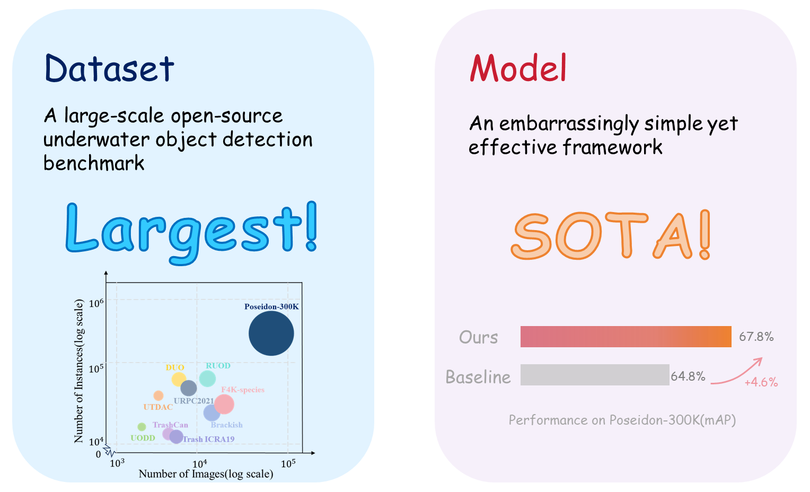
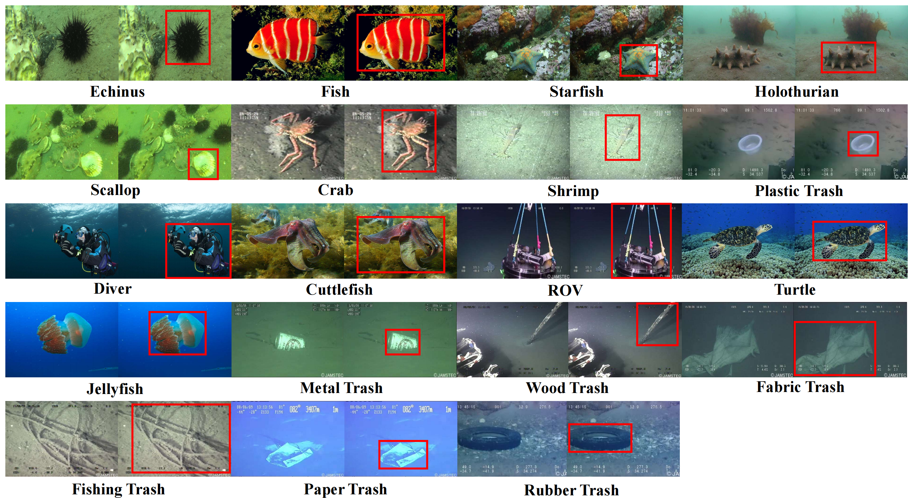
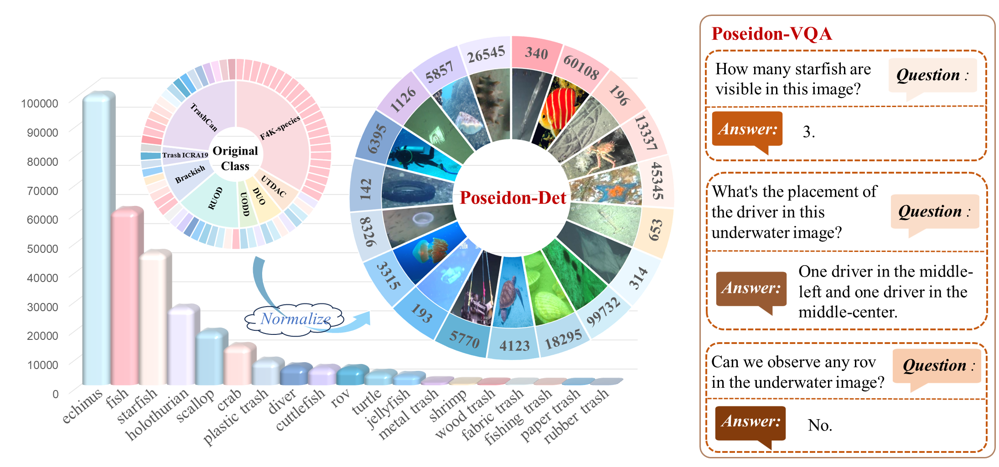
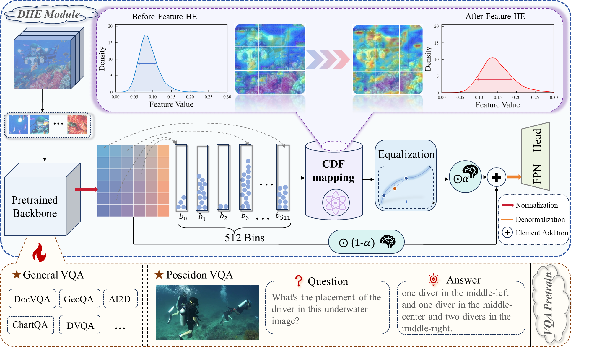

<div align="center">
  <h1><b>Poseidon-300K: Towards a Large-Scale Open Benchmark for Underwater Object Detection</b></h1>
  <p>
    <a href="https://arxiv.org/abs/2603.xxxxx"></a>
   <a href="https://github.com/your-username/HistEqDet">
    
  </a>
     <a href="https://pan.baidu.com/s/1uPXBMNPL0Amgg7bHbf7vHQ?pwd=sajp">
    
  </a>
     <a href="https://1drv.ms/u/c/869d5f1d401ac2ec/EZekCm-CurxGpYvC6isW8tgBUvvpJ6hurMe85xgqWK2qvw">
    
  </a>
</p>
  </p>

  <p>
    If you find our work helpful, please consider giving us a ⭐!
  </p>

  
  <br>
</div>

---

<!-- ## 🔥 Highlights -->


<!-- --- -->

## 📝 Abstract
Underwater object detection (UOD) plays a crucial role in marine ecosystem monitoring and environmental analysis, yet its progress is significantly hindered by the scarcity of large-scale standardized benchmarks and the severe feature ambiguity caused by aquatic image degradation.
To overcome these issues, we introduce **Poseidon-300K**, a large-scale open-source UOD benchmark comprising **85,000** images with over **300,000** detection instances, together with **258,000** annotated question-answer pairs for visual-semantic learning. To our knowledge, it constitutes the largest publicly accessible dataset in this field. 
Given that contrast attenuation constitutes the primary bottleneck in underwater vision, we contend that enhancing the feature-level contrast between foreground targets and backgrounds within the detection framework can fundamentally resolve the performance degradation. Consequently, we introduce HistEqDet, an embarrassingly simple yet effective framework that pioneers the integration of a dynamic Histogram Equalization (HE) mechanism directly within the detection architecture. This mechanism effectively suppresses background interference while accentuating target-relevant features. Furthermore, we adopt a top-down vision-language pretraining paradigm to internalize underwater-specific visual priors, providing a semantically grounded initialization for underwater tasks.
Extensive experiments on Poseidon-300K demonstrate that HistEqDet achieves state-of-the-art performance with 67.8\% mAP, validating the effectiveness of the method.

<p align="center">
  
  <br>
</p>


---

## 🌊 Poseidon-300K Dataset
**Poseidon-300K** is a large-scale and high-quality benchmark dataset for underwater object detection.Poseidon-300K comprises two specialized subsets: Poseidon-Det and Poseidon-VQA.

### 🖼️ Visualization
**Poseidon-Det** is a long-tail distributed benchmark comprising **19 marine categories**. The following figure presents the  representative examples from **Poseidon-VQA**.

<p align="center">
  
</p>

### 📊 Dataset Statistics
We compare Poseidon-300K with existing benchmarks to highlight its scale and diversity:
| Dataset | Image | Instance | Categories | COCO-Annotation | Pairs | Uneven Lighting | Blurriness | Low Contrast | Color Distortion |
|---------|------:|---------:|:-----:|:----------:|:-----------:|:---------------:|:----------:|:------------:|:---------------:|
| F4K-species | 27,370 | 27,370 | 23 | Y | - | ✅ | ✅ | ❌ | ❌ |
| UTDAC | 5,643 | 46,685 | 4 | Y | - | ✅ | ✅ | ✅ | ✅ |
| DUO | 7,782 | 74,515 | 4 | Y | - | ✅ | ✅ | ✅ | ✅ |
| UODD | 3,194 | 19,212 | 3 | Y | - | ✅ | ✅ | ✅ | ✅ |
| RUOD | 14,000 | 74,903 | 10 | Y | - | ✅ | ✅ | ✅ | ✅ |
| Brackish | 14,518 | 25,613 | 6 | N | - | ✅ | ✅ | ❌ | ❌ |
| Trash ICRA19 | 7,684 | 11,061 | 3 | Y | - | ❌ | ❌ | ✅ | ❌ |
| TrashCan | 7,212 | 12,480 | 16 | N | - | ❌ | ❌ | ✅ | ❌ |
| **Poseidon-300K** | **84,735** | **300,112** | **19** | **Y** | **258K (VQA)** | ✅ | ✅ | ✅ | ✅ |

### 📥 Download
- **Poseidon-Det**: [[Google Drive]](#) | [[Baidu Pan]](#) 
- **Poseidon-VQA**: [[Link]](#)


---
## 💡 HistEqDet:Histogram Equalization Detection Model
<p align="center">
  
  <br>
</p>

### Introduction
This repository is the official implementation of Histogram Equalization Detection Model in "Poseidon-300K: Towards a Large-Scale Open Benchmark for Underwater Object Detection"


---

## 📊 Results and Models
Comparison of different methods on Poseidon-300K.
| Method | Backbone | mAP | $AP_{50}$ | $AP_{75}$ |  $AP_{s}$ |Config | Download |
| :------ | :------ | :------: | :------: | :------: | :------:| :------: | :------: |
|YOLOF | ResNet-50|48.6 | 73.1 | 54.3  | 39.1 | 49.5 | 51.9
|Foveabox| ResNet-50|52.6 | 79.2 | 58.8 |38.1|46.9|56.6
|RetinaNet | ResNet-50| 56.4 | 81.9 | 63.3 | 40.6 | 50.7 | 61.1 
|FSAF | ResNet-50|57.0	|83.7	|64.5	|45.9	|50.5	|62.5
|RepPoints | ResNet-50|59.0 |85.8 | 67.0 |43.8 |53.0 | 64.8
|FCOS | ResNet-50| 60.2 | 88.2 | 67.8 | 44.8 | 54.9 | 64.2
| AutoAssign| ResNet-50|62.9 | 89.0 | 71.2  |52.3 | 56.6 | 67.3 
|VFNet| ResNet-50|63.7 | 87.1 | 72.2 | 50.2 | 57.1 | 68.5 
|GFL| ResNet-50| 64.0 | 87.4 | 72.5 | 49.5 | 57.0 | 69.2
|ATSS | ResNet-50| 64.3 |  88.8 | 72.9 | 49.8 | 57.4 | 68.8
|TOOD | ResNet-50|64.8| 89.1  |73.6 | 50.9  |57.7  |69.8
|Faster RCNN | ResNet-50| 61.4 | 87.7 | 69.9 | 49.8 | 55.3 | 65.0
|Libra RCNN | ResNet-50|61.7 | 87.9 | 70.9 | 48.7 | 55.7 | 66.2
|Grid RCNN| ResNet-50| 62.3 | 87.0 | 71.2 | 50.5 | 56.3 | 66.5
| Dynamic RCNN| ResNet-50| 63.8 | 87.7 | 72.9 | 50.4 | 57.1 | 67.5
|Cascade RCNN | ResNet-50| 63.9 | 87.6 | 72.5 | 50.5 | 57.5 | 68.7
|DINO| ResNet-50|53.6|79.5|58.2|35.6|44.8|61.5
| Sparse RCNN| ResNet-50|56.8 | 83.6 | 63.5 | 42.9 | 49.4 | 62.1 
|GCCNet |53.8 | 82.2 | 59.7 | 46.8 | 49.2 | 56.3 
|AMSP-UOD|55.9|81.8|74.0|41.1|48.4|65.0
| RoIAttn |57.6 | 85.2 | 65.2 | 39.8 | 52.0 | 62.8
| Boost RCNN |57.6 | 84.3 | 66.1 | 41.8 | 50.1 | 62.3 
| ERLNet|58.5 | 83.1 | 65.8 | 44.8 | 52.8 | 60.3 
|UnitModule |58.8 | 86.0 | 64.8 | 45.8| 51.8 | 66.7
|HistEqDet |88.2| 76.8 | 54.3 | 61.4 | 70.2|53.9
data
---

## 🛠️ Installation
Our code depends on [PyTorch](https://pytorch.org/), [MMCV](https://github.com/open-mmlab/mmcv) and [MMDetection](https://github.com/open-mmlab/mmdetection). Below are quick steps for installation. Please refer to the [Install Guide](https://mmdetection.readthedocs.io/en/latest/get_started.html) for more detailed instructions.

---
### Step 1: Create a conda environment

```shell
conda create --name poseidon python=3.8
conda activate poseidon
```

### Step 2: Install the required packages

```shell
pip install torch==2.0.1 torchvision==0.15.2 torchaudio==2.0.2 --index-url https://download.pytorch.org/whl/cu118
pip install -U openmim dadaptation cmake lit --no-input
mim install mmengine "mmcv==2.0.1" "mmdet==3.0.0" "mmrotate==1.0.0rc1"
```

### Step 3: Insatall flash attention
```shell
git clone https://github.com/Dao-AILab/flash-attention.git
cd flash-attention
git checkout v0.2.8
pip install ninja
python setup.py install
cd ..
```

### Step 4: Install poseidon
```shell
pip install -r requirements.txt
pip install -e .
```

### Step 5: Compile custom operators
```shell
cd ops
sh make.sh
cd ..
```
---
### 🚀 Train
```shell
sh tools/dist_train.sh 
```
### 🔍 Test
```shell
sh tools/dist_test.sh 
```

## Citation
If you use this toolbox or benchmark in your research, please cite this project.
